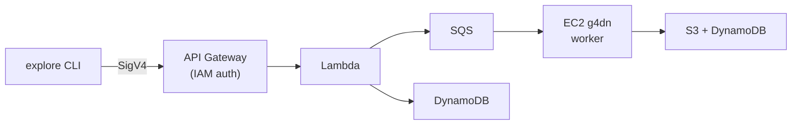

# TopoStreams

Stellar stream discovery using persistent homology on Gaia data.

TopoStreams applies topological data analysis (TDA) to Gaia DR3 phase-space data to detect stellar streams. It uses kNN density filtration to compute persistent homology, identifying elongated structures as topological features with high persistence. The pipeline runs locally or on AWS with GPU acceleration.

## Packages

| Package          | Language         | Description                                          |
| ---------------- | ---------------- | ---------------------------------------------------- |
| `stream-finder`  | Python           | Core library — kNN density filtration + PH           |
| `explore`        | Python           | CLI + AWS API client for stream recovery             |
| `worker`         | Python           | SQS consumer — GPU pipeline on EC2 g4dn              |
| `cuda-kernels`   | C++/CUDA         | GPU-accelerated kNN, persistence, radius queries     |
| `infrastructure` | TypeScript (CDK) | AWS backend — API Gateway, Lambda, SQS, S3, DynamoDB |
| `docs`           | TypeScript       | Docusaurus documentation site                        |

## Architecture



The `explore` CLI operates in two modes:

- **Local**: runs `stream-finder` directly (CPU or GPU if `topostreams-cuda` is installed)
- **API**: submits jobs to the AWS backend via SigV4-signed requests, polls for completion, downloads results

## Quick start

```bash
# Install tool versions
mise install

# Python dependencies
uv sync --group dev

# JS/TS dependencies
yarn install

# See available streams
uv run explore catalog

# Run stream recovery on Palomar 5
uv run explore recover palomar-5 --output-dir /tmp/test

# Generate plots from a run
uv run explore plot /tmp/test/palomar-5/<timestamp>
```

## Development

```bash
# Python tests
uv run pytest packages/stream-finder/tests -v
uv run pytest packages/explore/tests -v
uv run pytest packages/worker/tests -v

# CDK tests
yarn workspace @topology-streams/infrastructure test

# Lint + typecheck
yarn lint && yarn typecheck

# Start docs locally
yarn workspace @topology-streams/docs start
```

## License

MIT
