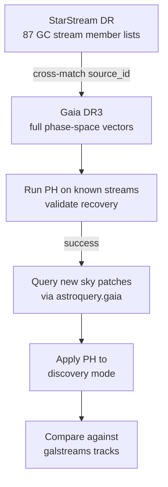

# Pre-processed Catalogs

These catalogs provide cleaned, ready-to-use data — no raw observation processing needed.

## 1. StarStream DR — Member stars for 87 GC streams

The **best starting point for validation**. Provides actual member star lists with Gaia `source_id` values for 87 globular cluster streams detected in Gaia DR3.

- Cross-match source IDs with Gaia DR3 to get full phase-space info, then run PH
- 34 high-quality detections with median completeness and purity > 50%
- **GitHub**: [ybillchen/StarStream_DR](https://github.com/ybillchen/StarStream_DR)
- **Paper**: [arXiv:2510.14924](https://arxiv.org/abs/2510.14924)

## 2. galstreams — Stream tracks & footprints (~100 streams)

A Python library providing sky tracks, proper motion tracks, distance tracks, and radial velocity tracks for ~100 known streams as `astropy.SkyCoord` objects.

**No individual member stars** — provides the stream paths for overlay/validation of detections.

```bash
pip install git+https://github.com/cmateu/galstreams
```

- **GitHub**: [cmateu/galstreams](https://github.com/cmateu/galstreams)
- **Paper**: [arXiv:2204.10326](https://arxiv.org/abs/2204.10326)

## 3. STREAMFINDER Atlas — 87 thin streams in DR3

Full stream catalog with member star IDs from Gaia DR3. Available as supplementary material with the paper.

- **Paper**: [arXiv:2311.17202](https://arxiv.org/abs/2311.17202)

## 4. GD-1 membership catalog — 1,689 member stars

The largest GD-1 member catalog to date, with membership probabilities.

- **Paper**: [arXiv:2502.13236](https://arxiv.org/html/2502.13236)

## 5. Via Machinae 2.0 — 102 stream candidates

Full-sky scan of Gaia DR2; 102 candidates at high significance (only 10 previously known). Catalogs published with the paper.

- **Paper**: [arXiv:2303.01529](https://arxiv.org/abs/2303.01529)

## 6. StreamCatalogs — Simulated GC streams (for testing)

Catalogs from cosmological simulations (TNG50, FIRE-2) with **known ground truth**. Useful for benchmarking PH before applying to real data.

- **GitHub**: [cholm-hansen/StreamCatalogs](https://github.com/cholm-hansen/StreamCatalogs)

## Recommended workflow



1. **Validate**: Download StarStream DR member catalogs, cross-match with Gaia DR3 via `source_id`, run PH on known streams to check if persistence diagrams recover them
2. **Discovery**: Use `astroquery.gaia` to query sky patches with quality cuts, apply PH to phase-space point clouds
3. **Compare**: Overlay detections against galstreams tracks and existing catalogs
