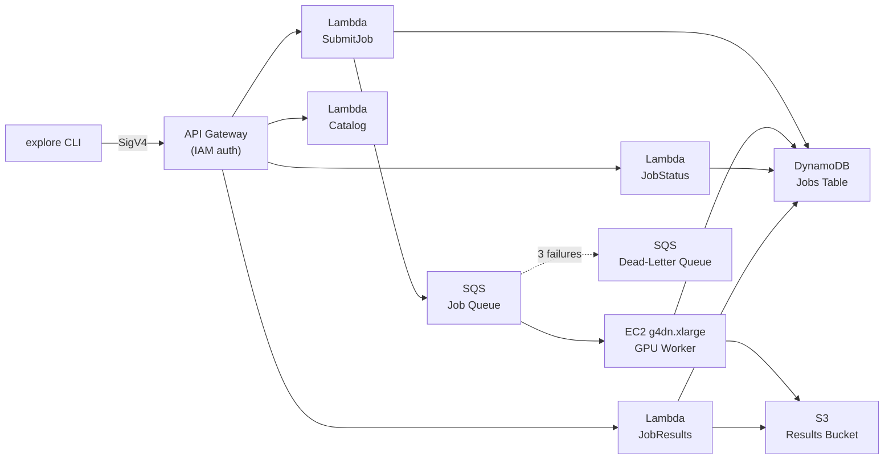
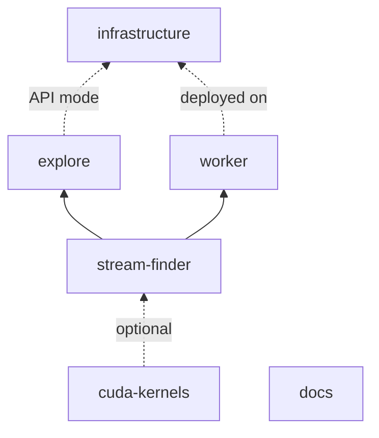

# Project Architecture

## Monorepo structure

TopoStreams is a polyglot monorepo managed with **Yarn workspaces** (TypeScript) and **uv workspaces** (Python).

```
topology-streams/
├── packages/
│   ├── stream-finder/      # Python — PH-based stream detection library
│   ├── explore/            # Python — CLI + AWS API client
│   ├── worker/             # Python — SQS consumer for GPU pipeline
│   ├── cuda-kernels/       # C++/CUDA — GPU-accelerated kernels + Python bindings
│   ├── infrastructure/     # TypeScript — AWS CDK stacks (4 stacks, 4 Lambda handlers)
│   └── docs/               # TypeScript — Docusaurus documentation
├── package.json            # Yarn workspace root
├── pyproject.toml          # uv workspace root
├── tsconfig.json           # TypeScript project references
└── .github/workflows/      # CI/CD pipelines
```

## Python packages

### stream-finder

Core library implementing kNN density filtration for stellar stream detection. Provides the topology computation, candidate extraction, data ingestion, and visualization modules. Supports optional GPU acceleration via `topostreams-cuda`.

**Key modules:** `topology.py`, `streams.py`, `data.py`, `visualization.py`, `_gpu.py`

### explore

CLI tool and AWS API client for running stream recovery pipelines. Operates in two modes: **local** (direct `stream-finder` calls) or **API** (submits jobs to the AWS backend via SigV4-signed requests).

**Key modules:** `cli.py`, `commands/` (recover, catalog, plot, status, jobs), `_api_client.py`, `_config.py`, `_types.py`

### worker

SQS consumer that runs the stream recovery pipeline on GPU-enabled EC2 instances. Polls the job queue, executes the same pipeline as local mode, and writes results to S3/DynamoDB.

**Key modules:** `main.py`, `pipeline.py`, `config.py`, `dynamodb.py`, `s3_io.py`

### cuda-kernels

C++/CUDA kernels with Python ctypes bindings providing GPU-accelerated replacements for the CPU-bound steps: kNN search, density filtration, persistent homology (H0/H1), and radius queries.

**Key modules:** `knn.cu`, `density.cu`, `persistence_h0.cu`, `persistence_h1.cu`, `radius_query.cu`

## TypeScript packages

### infrastructure

AWS CDK application with 4 stacks deploying the full backend: API Gateway + Lambda handlers, SQS job queue, S3 results bucket, DynamoDB jobs table, VPC with GPU EC2 instance, ECR repository, and GitHub OIDC for CI/CD.

**Stacks:** StorageStack, ComputeStack, ApiStack, GitHubOIDCStack

### docs

This Docusaurus documentation site.

## AWS architecture



## Package dependencies



## Tooling

| Tool                 | Purpose                                        |
| -------------------- | ---------------------------------------------- |
| **Yarn 4**           | JavaScript/TypeScript package management       |
| **uv**               | Python package management (workspace mode)     |
| **mise**             | Tool version management (Node 22, Python 3.11) |
| **ESLint 9**         | TypeScript linting (flat config)               |
| **Prettier**         | Code formatting (JS/TS/JSON/YAML/MD)           |
| **Black + isort**    | Python formatting                              |
| **Flake8 + Pylint**  | Python linting                                 |
| **MyPy**             | Python type checking (strict)                  |
| **Pytest**           | Python testing                                 |
| **Jest**             | TypeScript testing                             |
| **Commitlint**       | Conventional commit enforcement                |
| **Semantic Release** | Automated versioning and changelog             |
| **Pre-commit**       | Git hook management                            |
