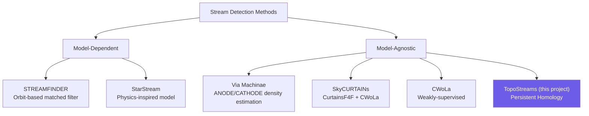

# Discovery Methods

All modern stream-finding methods exploit Gaia's **5D+ phase-space information** (position + proper motion + optionally radial velocity and parallax). Stream members share similar kinematics, so spatial overdensities of stars with correlated proper motions are strong stream candidates.

## A. Physics-based matched filtering

### STREAMFINDER (Malhan & Ibata, 2018)

- Searches for stream-like overdensities using **orbit models** in the combined space of photometry + astrometry
- Can detect ultra-faint structures with as few as **~15 member stars**
- Produced the largest atlas to date on Gaia DR3 (87 structures, 29 new)
- [arXiv:1804.11338](https://arxiv.org/abs/1804.11338)

### StarStream (2025)

- Physics-inspired model predicting stream stars in **multidimensional observable space**
- Does **not** rely on visual expectations of thin/cold morphology — removes bias toward dynamically cold streams
- Enables unbiased mass-loss rate estimates for progenitor globular clusters
- Found that many streams are wide, short, or misaligned — contradicting traditional assumptions
- [Algorithm: arXiv:2510.14929](https://arxiv.org/abs/2510.14929) | [Results: arXiv:2510.14924](https://arxiv.org/abs/2510.14924)

## B. Machine learning / anomaly detection (model-agnostic)

### Via Machinae (Shih & Buckley)

- **Unsupervised ML** using neural density estimators
- v1.0 used ANODE; v3.0 upgraded to **CATHODE** (borrowed from particle physics anomaly detection)
- **No assumptions** about the Galactic potential, orbits, or isochrones
- Full-sky, fully automated
- [VM1: arXiv:2104.12789](https://arxiv.org/abs/2104.12789) | [VM2: arXiv:2303.01529](https://arxiv.org/abs/2303.01529) | [VM3: arXiv:2509.08064](https://arxiv.org/abs/2509.08064)

### SkyCURTAINs (2024)

- **Weakly-supervised** two-stage approach: CurtainsF4F + CWoLa + Hough transform
- Adapted from high-energy physics anomaly detection
- Recovers GD-1 with **75% purity** (>10% improvement over prior ML methods)
- [arXiv:2405.12131](https://arxiv.org/abs/2405.12131)

### CWoLa — Classification Without Labels (2024)

- Weakly-supervised anomaly detection applied to Milky Way substructure
- [arXiv:2305.03761](https://arxiv.org/abs/2305.03761)

## C. Neural network topology learning

### StarGO (Yuan et al., 2019)

- Self-organizing map that learns topological structure of datasets in **angular momentum + orbital energy space**
- Used to identify Sagittarius, Orphan, and Cetus streams
- Note: This uses neural network manifold learning, **not** algebraic topology / persistent homology
- [ADS](https://ui.adsabs.harvard.edu/abs/2019ApJ...881..164Y/abstract)

## D. Chemo-kinematic tagging

- Clustering in combined **chemical-abundance + kinematic space**
- Increases dimensionality of discovery space
- Used to identify tidally stripped members
- [A&A 2025](https://www.aanda.org/articles/aa/full_html/2025/12/aa54934-25/aa54934-25.html)

## E. Deep learning

### Stellar wakes detection (2024)

- Deep learning approach for detecting stellar wakes in the Milky Way
- [arXiv:2412.02749](https://arxiv.org/abs/2412.02749)

## Summary

