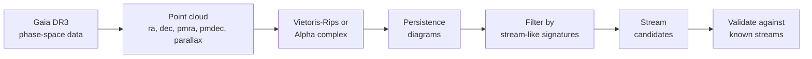

# The Persistent Homology Gap

## Status

**No published work applies persistent homology (PH) to stellar stream discovery in Gaia or other surveys.** This represents a clear gap in the literature.

## Where PH/TDA is used in astronomy

Persistent homology and topological data analysis have been successfully applied to several areas of astronomy:

| Application          | Description                                          | Reference                                                                                  |
| -------------------- | ---------------------------------------------------- | ------------------------------------------------------------------------------------------ |
| Cosmic web structure | Filaments, voids, clusters in large-scale structure  | [ADS 2018](https://ui.adsabs.harvard.edu/abs/2018AAS...23121307C/abstract)                 |
| Cosmic shear         | Weak lensing parameter constraints                   | [A&A 2021](https://www.aanda.org/articles/aa/full_html/2021/04/aa39048-20/aa39048-20.html) |
| Exoplanet detection  | Kepler light curves via TDA on time-delay embeddings | [KoreaScience 2025](https://www.koreascience.kr/article/JAKO202520261203526.pub)           |
| Galaxy morphology    | Simulated galaxies vs dark matter halos              | [MNRAS 2023](https://academic.oup.com/mnras/article/523/4/5738/7197452)                    |

### General TDA references

- [Introduction to TDA for physicists](https://arxiv.org/abs/1904.11044) (2019)
- [TDA and Machine Learning survey](https://www.tandfonline.com/doi/full/10.1080/23746149.2023.2202331) (2023)
- [TDA beyond Persistent Homology — review](https://arxiv.org/abs/2507.19504) (2025)

## Why PH is a natural fit for streams

### 1. Streams are 1D manifolds in high-dimensional space

Stellar streams are essentially 1-dimensional curves (or narrow tubes) embedded in 5-6 dimensional phase space. Persistent homology is designed to detect exactly this kind of topological structure:

- **$H_0$ (connected components)**: Identifies clusters of stars that belong to coherent structures
- **$H_1$ (loops)**: Could detect streams that wrap around the Galaxy or form closed orbits

### 2. Robustness to noise

PH naturally distinguishes persistent topological features from noise via **persistence diagrams**. Features that persist across many scales are real; those that appear and disappear quickly are noise. This is precisely the challenge in stream detection — separating genuine kinematic coherence from the field population.

### 3. Model-agnostic

Like Via Machinae and SkyCURTAINs, PH requires **no assumptions** about orbits, the Galactic potential, or stellar isochrones. But unlike those methods, it does not require training neural networks or choosing hyperparameters for density estimation.

### 4. Scale-free

Persistent homology captures features across **all spatial scales simultaneously**, via the filtration parameter. This is particularly useful given the diversity of stream widths and lengths revealed by StarStream (2025) — many streams are wider or shorter than previously assumed.

### 5. Complementary to existing methods

PH offers a fundamentally different mathematical framework. It could detect wide, short, or morphologically unusual streams that matched-filter methods miss, and provide independent validation of ML-based candidates.

## Potential approach

1. Compute **Vietoris-Rips or alpha complexes** on Gaia phase-space data (position + proper motion)
2. Use **persistence diagrams / barcodes** to identify features with high persistence
3. Filter by **stream-like topological signatures** (elongated $H_0$ components that merge at characteristic scales)
4. **Validate** against known streams (GD-1, Pal 5) before searching for new candidates
